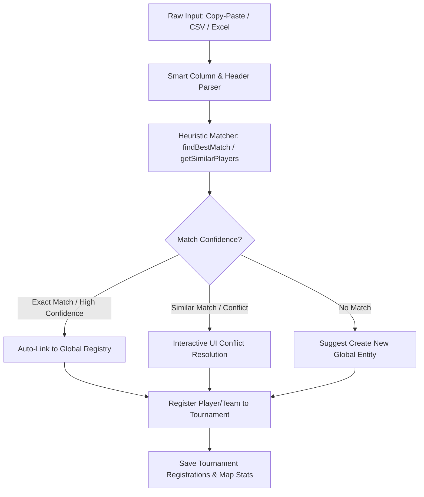

# Player & Team Entry Logic & UI Architecture

This document breaks down the logic, data structure, similarity algorithms, and UI approaches used for player and team registration, entry, and stats matching in the stat engine.

---

## 1. System Architecture & Flow

The system separates the **Global Registries** (which hold permanent career player profiles and team entities) from **Tournament Registrations** (which link players/teams to specific tournaments and assign slots/classes).



---

## 2. Core Logic Breakdowns

### A. Similarity Matching & Deduplication
To prevent duplicate players (e.g., `"Liquid Core"` vs. `"Core"`) and teams from polluting the database, the system uses a normalized **Levenshtein Distance** with a **containment booster**:

1. **Normalization**: Strings are converted to lowercase, trimmed, and stripped of non-alphanumeric characters.
2. **Containment Booster**: If either cleaned string is longer than 3 characters and contains the other (e.g., `"Main Characters OG"` and `"Main Characters"`), a similarity score of `0.85` is automatically granted.
3. **Levenshtein Distance Fallback**: Otherwise, the Levenshtein distance is calculated:
   $$\text{Similarity} = 1.0 - \frac{\text{LevenshteinDistance}(s_1, s_2)}{\max(\text{length}(s_1), \text{length}(s_2))}$$
4. **Heuristic Threshold**: Similarities $\ge 0.75$ trigger warnings or open the conflict resolution modal.

### B. Smart Spreadsheet & Paste Parsing
* **Dynamic Column Mapping**: Instead of forcing the user to format their tables in a single way, the parser scans the first few rows looking for header cells containing keywords (`player`, `ign`, `team`, `slot`, `kills`, `damage`, etc.).
* **Auto-Delimiter Detection**: Raw text copies are analyzed for `\t` (tabs from Excel), commas, or semicolons to build a matrix.
* **Match Confidence (Scoring)**:
  * Cleaned IGN/Pro Name matches exactly $\rightarrow$ **+100 / +90 points**.
  * Name includes registry name (or vice versa) $\rightarrow$ **+50 / +40 points**.
  * Cleaned Team name matches exactly $\rightarrow$ **+50 points** booster.
  * *High Confidence* $\ge 140$, *Medium* $\ge 80$, *Low* $< 80$.

---

## 3. UI and Structure Approach

1. **Interactive Conflict Resolution Modal**: When importing teams/players, if any entry flags a similarity threshold match ($\ge 0.75$) with an existing record, the system presents a review card showing the duplicate. The user can toggle between:
   * **Link to Existing**: Links the tournament slot to the existing global registry ID and syncs any new details.
   * **Register as New**: Creates a completely new global registry entry (useful for distinct players with identical/similar tags).
2. **Inline Editable Grid (`EditableCell`)**: An overlay table where users can click any cell to turn it into an input box (`onBlur` or `Enter` automatically triggers an auto-save / Firestore write).
3. **Smart Data Previews**: Displays parsed metrics (e.g. Day, Lobby, Kills, Damage, Accuracy) next to the matched player names with colored confidence indicators (`green` for high, `yellow` for medium/low, `red` for unmatched) prior to committing the bulk write.

---

## 4. Prompt Template for Other Projects

Below is a prompt you can use to instruct another AI coding assistant to build this exact capability.

***

```markdown
Role: Senior Frontend & Database Engineer
Task: Implement a player/team registration and entry system with dynamic column mapping, string similarity matching, and a conflict resolution UI.

### 1. Data Schemas
Define the following data layers:
- **Global Players**: { id, professionalName, professionalNameLower, ign, ignLower, gender, region, country, device, deviceModel, category, tournamentIds[], createdAt }
- **Global Teams**: { id, teamName, teamNameLower, clanName, clanNameLower, tournamentIds[], createdAt }
- **Tournament Registrations**: Links global player/team IDs to a tournament. Contains tournamentId, slot number, and specific configurations (e.g. tier, class, custom player labels for that event).

### 2. Matching & Similarity Algorithm
Implement:
- A helper function that cleans strings (converts to lowercase, removes non-alphanumeric characters).
- Levenshtein Distance calculation.
- Similarity score: `1.0 - (Levenshtein / max_length)`.
- If either string is > 3 chars and contains the other, auto-boost the score to 0.85.
- Helper functions `getSimilarPlayers(name, ign, globalPlayers, threshold=0.75)` and `getSimilarTeams(name, globalTeams, threshold=0.75)`.

### 3. CSV/Excel & Copy-Paste Parsers
Implement a heuristic spreadsheet grid parser:
- Automatically identify delimiters (tabs, commas).
- Heuristically detect column headers (`player`, `ign`, `team`, `slot`, `kills`, etc.) by scanning the first 15 rows.
- Score parsed data matches against registered tournament players:
  - Exact IGN/Name match: +100/+90
  - Substring/containment match: +50/+40
  - Same team name match: +50 booster
  - Classify confidence: High (>=140), Medium (>=80), Low (<80).

### 4. Interactive UX Requirements
- **Toolbar Actions**: Add buttons for "Upload CSV / Excel", "Paste Data", and "Add Manually".
- **Paste Panel**: A simple text area accepting raw tabbed or comma lists.
- **Deduplication Sync Modal**: If any similar team/player is found during imports, present an interactive table listing:
  - The entered name.
  - The warning about similar entries.
  - Interactive choice buttons: [Link to Existing] and [Register as New].
- **Editable Table Grid**: Render an interactive grid using inline editing. Clicking a cell turns it into an input field. Pressing Enter or clicking outside (blur) commits the update to the database.
- **Confidence Indicators**: When mapping imported statistics (e.g. match results), highlight the matched entity with green/yellow/red badges based on the confidence score so the user can easily re-map mismatched profiles before saving.
```

***

Working
